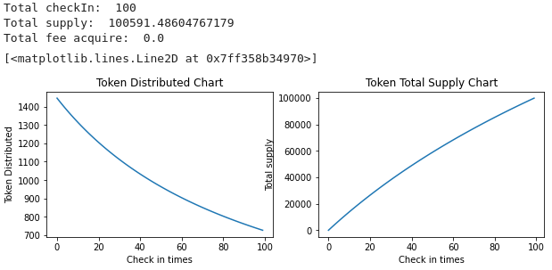
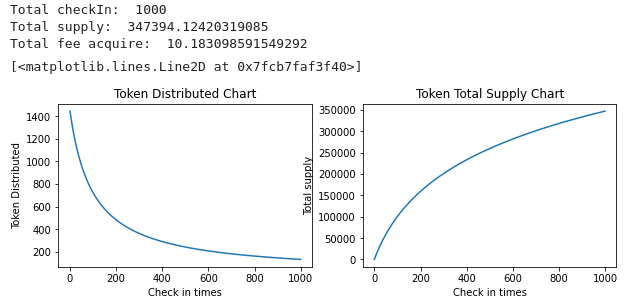
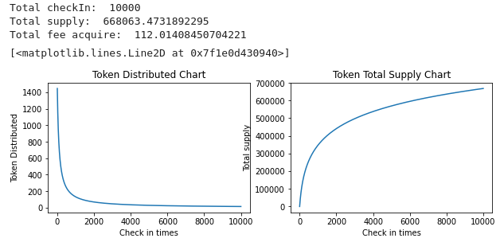
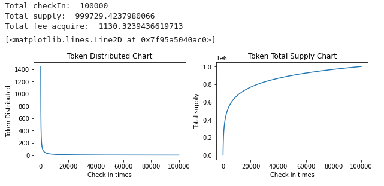
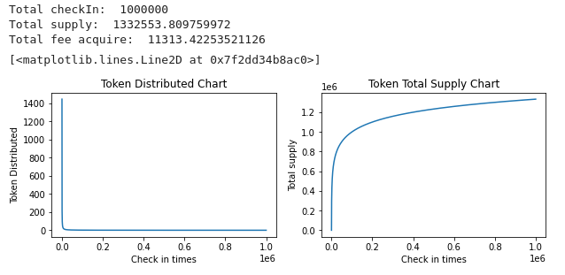

# CBLB token issue model

The document `token-issue-model.ipynb` describes the issuance model of cblb token.

100 times check-in token issue chart  

1,000 times check-in token issue chart  

10,000 times check-in token issue chart  

100,000 times check-in token issue chart  

1,000,000 times check-in token issue chart  

