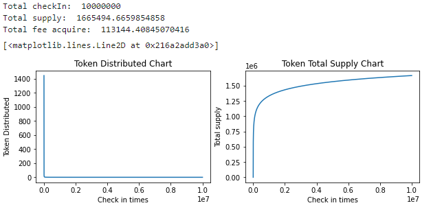

# CBLB token issue model

Inspired by **Torricelli's Trumpet**, appropriately increase the ratio and displacement parameter modification formula as the following form, and use the sign-in behavior as the only trigger condition for the issuance of CBLB Token.

CBLB token issuance formula  
$$issueAmountPerCheckin = 144600/(checkinIndex + 100)$$

The document `token-issue-model.ipynb` contains a simulation of the issuance chart of CBLB token.

**100 times check-in token issue chart**  

**1,000 times check-in token issue chart**  

**10,000 times check-in token issue chart**  

**100,000 times check-in token issue chart**  

**1,000,000 times check-in token issue chart**  

**10,000,000 times check-in token issue chart**  

